# Adobe Post-MAX Communication Strategy Visualizations

Visual diagrams illustrating how agentic engineering scales Adobe's post-conference communication.

---

## 1. 48-Hour Post-Keynote Campaign Flow


---

## 2. Brand Asset Factory Production Pipeline


---

## 3. Annual Asset Production Scale


**Calculation**: 8 products × 12 campaigns × 6 asset types × 15 regions = **8,640 unique assets**

---

## 4. Customer Segment Content Engine

```mermaid
flowchart TB
    subgraph SEGMENTS["👥 CUSTOMER SEGMENTS"]
        direction LR
        SEG1["🎨 Creative<br/>Professional"]
        SEG2["📊 Marketing<br/>Team"]
        SEG3["🏢 Enterprise"]
        SEG4["🏪 SMB"]
        SEG5["🎓 Education"]
    end

    subgraph PERSONALIZATION["🎯 PERSONALIZATION LAYER"]
        direction TB

        subgraph VOICE["Voice Adaptation"]
            V1["Peer-to-Peer<br/>(Creative Pro)"]
            V2["Strategic Partner<br/>(Enterprise)"]
            V3["Helpful Friend<br/>(SMB)"]
        end

        subgraph IMAGERY["Firefly Imagery"]
            I1["Studio Setting<br/>(Creative Pro)"]
            I2["Boardroom<br/>(Enterprise)"]
            I3["Home Office<br/>(SMB)"]
        end

        subgraph CONTENT["Content Types"]
            C1["Tutorials<br/>Inspiration"]
            C2["Case Studies<br/>ROI Tools"]
            C3["Quick Tips<br/>Templates"]
        end
    end

    subgraph GENERATION["⚡ PARALLEL GENERATION"]
        F1[Fork 1-4<br/>Creative Pro]
        F2[Fork 5-8<br/>Marketing]
        F3[Fork 9-12<br/>Enterprise]
        F4[Fork 13-16<br/>SMB]
        F5[Fork 17-20<br/>Education]
    end

    subgraph DELIVERY["📬 PERSONALIZED DELIVERY"]
        D1[Email<br/>Journeys]
        D2[Web<br/>Experience]
        D3[Sales<br/>Enablement]
        D4[Community<br/>Content]
    end

    SEGMENTS --> PERSONALIZATION
    PERSONALIZATION --> GENERATION
    GENERATION --> DELIVERY

    style SEG1 fill:#31A8FF,color:#fff
    style SEG2 fill:#FF9A00,color:#fff
    style SEG3 fill:#FA0F00,color:#fff
    style SEG4 fill:#FF0099,color:#fff
    style SEG5 fill:#00C853,color:#fff
```



---

## 5. Regional Localization: Sequential vs. Parallel


**Result**: 68% reduction in time-to-market (19 days → 6 days)

---

## 6. E2B Sandbox Fork Architecture


---

## 7. MAX 2025 Announcement Content Matrix

```mermaid
flowchart LR
    subgraph ANNOUNCEMENTS["📢 MAX 2025 ANNOUNCEMENTS"]
        A1["Firefly<br/>Image Model 5"]
        A2["AI Assistant<br/>in Photoshop"]
        A3["Creative<br/>Production"]
        A4["Partner<br/>Models"]
    end

    subgraph CHANNELS["📱 CHANNELS"]
        CH1[Twitter/X]
        CH2[LinkedIn]
        CH3[Instagram]
        CH4[Email]
        CH5[Blog]
        CH6[Landing Page]
    end

    subgraph SEGMENTS["👥 SEGMENTS"]
        S1[Creative Pro]
        S2[Marketing]
        S3[Enterprise]
        S4[SMB]
        S5[Education]
    end

    subgraph REGIONS["🌍 REGIONS"]
        R1[Americas]
        R2[EMEA]
        R3[APAC]
    end

    ANNOUNCEMENTS --> CHANNELS
    CHANNELS --> SEGMENTS
    SEGMENTS --> REGIONS

    style A1 fill:#FF6B00,color:#fff
    style A2 fill:#31A8FF,color:#fff
    style A3 fill:#9999FF,color:#fff
    style A4 fill:#00C853,color:#fff
```



**Content Permutations**: 4 announcements × 6 channels × 5 segments × 3 regions = **360 content variations**

---

## 8. ROI Comparison: Traditional vs. Agentic


| Metric | Traditional | E2B Agentic | Improvement |
|--------|-------------|-------------|-------------|
| Assets per day | 20-30 | 500+ | **20x** |
| Time to market | 2-3 weeks | 24-48 hours | **10x faster** |
| Cost per asset | $50-200 | $0.50-2.00 | **100x cheaper** |
| Brand consistency | ~75% | 98%+ | **Automated validation** |

---

## 9. Firefly + Bencium Integration Flow


---

## 10. Post-MAX Timeline: 48-Hour Sprint


---

## Usage

These Mermaid diagrams can be rendered in:

- GitHub README/Wiki
- GitLab Markdown
- Notion
- Obsidian
- VS Code with Mermaid extension
- Any Mermaid-compatible viewer

To preview locally:

```bash
# Install Mermaid CLI
npm install -g @mermaid-js/mermaid-cli

# Generate PNG/SVG
mmdc -i post-max-strategy-visualizations.md -o output.png
```

---

## Key Takeaways

1. **Parallelization is the multiplier**: 20 forks = 20x throughput
2. **Brand compliance is automated**: Tokens enforced, not hoped for
3. **Regional is simultaneous**: Not sequential queues
4. **Segment personalization scales**: Same effort, 5x relevance
5. **48 hours is realistic**: With agentic architecture
